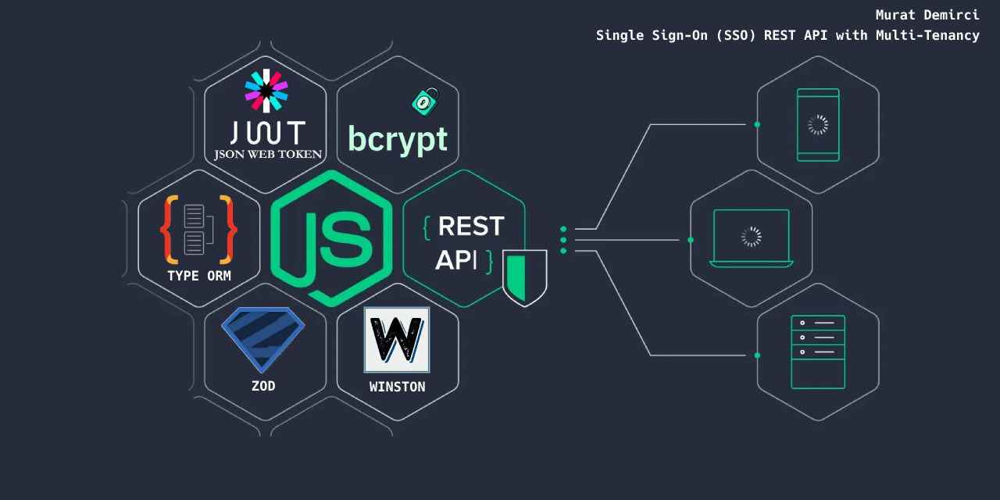

# NodeJs TypeScript SSO Rest API

This project is a Single Sign-On (SSO) REST API with Multi-Tenancy, constructed using Node.js and TypeScript.

## Description

The SSO API is a project that allows users to authenticate once and gain access to the resources of multiple software systems.

## Getting Started

### Prerequisites

- Node.js
- TypeScript
- PostgreSQL (or any database you prefer, just make sure to install the corresponding driver)

### Installation

1. Clone the repository
2. Install the dependencies with `npm install`
3. Copy `.env.example` to `.env` and fill in your database credentials and other configurations
4. Run the migrations with `npm run migration:run`
5. Build the project with `npm run build`
6. Start the server with `npm run start`

## Scripts

- `npm run test`: Runs the tests (currently not specified)
- `npm run prebuild`: Removes the `dist/` directory
- `npm run build`: Compiles TypeScript files into JavaScript
- `npm run watch-ts`: Watches for changes in TypeScript files
- `npm run start-ts`: Starts the server from the compiled JavaScript files
- `npm run start`: Builds and starts the server
- `npm run dev`: Starts the server in development mode with nodemon
- `npm run create`: Creates a new TypeORM migration
- `npm run migration:generate`: Generates a new TypeORM migration
- `npm run migration:create`: Creates a new TypeORM migration
- `npm run migration:run`: Runs the TypeORM migrations
- `npm run migration:revert`: Reverts the last TypeORM migration

## Dependencies

This project uses several dependencies, including:

- `bcrypt` for password hashing
- `jsonwebtoken` for JWT handling
- `typeorm` for ORM
- `zod` for schema validation
- `express` for the server
- `dotenv` for environment variable management
- `winston` for logging

## Author

Murat Demirci
